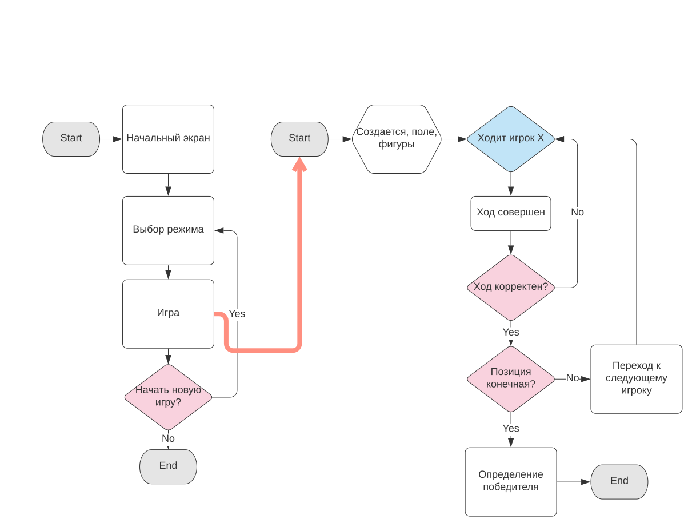
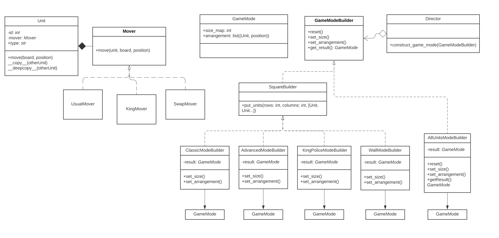
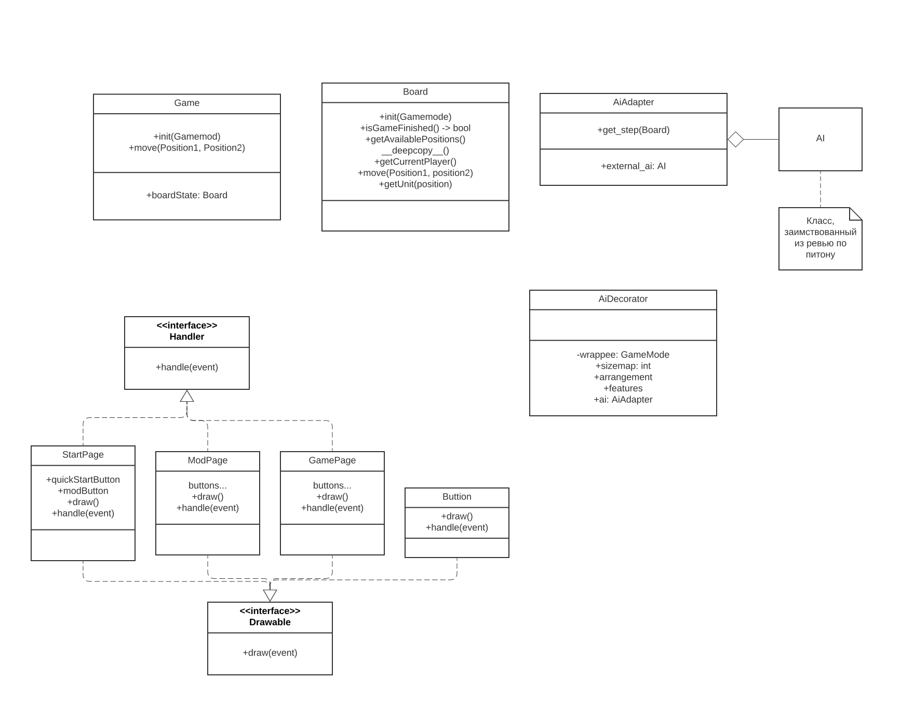

**Проект для курса "Технологии программирования". Игра "Продвинутые уголки"**
==========

Описание и правила игры
----------

Правила классической игры следующие.

Игра происходит на шахматной доске с участием двух игроков. В начале в противоположных углах поля, на квадратах 3x3 стоят по девять фигур каждого игрока. Цель - поставить собственные фигуры в противоложный угол (на места, где изначально стояли фигуры соперника) раньше, чем это сделает оппонент. 

Игроки ходят по очереди. Во время своего хода игрок может выбрать любую свою фигуру и переместить ее.
Перемещать можно одним из следующим способов.

1. Подвинуть на соседнюю по стороне клетку.
2. Сделать несколько прыжков. Прыжок - перемещение фигуры на 2 клетки по вертикали или горизонтали. Прыжок можно совершить, если между начальным и конечным положением фигуры, стоит другая фигура (своя либо противника). Таким образом, можно несколько раз подряд перепрыгнуть через фигуры.

В процессе игры в каждой клетке должно стоять не более 1 фигуры. Побеждает тот, кто поставит свои фигуры на места противника первым.

Дополнительная функциональность
----------

"Продвинутые уголки" поддерживают различные режимы с измененными правилами игры. Отличия состоят в следующем:

1. Размеры досок
2. Исходная расстановка
3. Много видов фигур с уникальными свойствами
4. Клетки доски с разными свойствами (свободная, заблокированная, и т.п.)

Виды фигур
----------

1. _Пешка_. Может ходить в соседнюю по стороне клетку и не может прыгать. 
2. _Король_. Может ходить в соседнюю по углу клетку и не может прыгать.
3. _Обычная фигура_. Может ходить в соседнюю по стороне клетку и прыгать.
4. _Флекс-фигура_. Может ходить в соседнюю по углу клетку и прыгать.
5. _Полицейский_. Ходит как король, и блокирует движение фигур соперника, стоящих в квадрате 3x3 вокруг него. При этом фигуры могут попадать в эту область в процессе движения.
6. _Ладья_. Может переместиться в любую клетку на той же вертикали или горизонтали и не может прыгать.
7. _Слон_. Может переместиться в любую клетку на той же диагонали и не может прыгать.
8. _Змейка_. Ходит как нормальная фигура, но в процессе движения может переходить через границу доски, попадая в соответствующую клетку с другой стороны доски.
9. _Vengeful Spirit_. За ход может поменяться местами с любой другой фигурой.
10. _Дамка_. Может переместиться в любую свободную клетку.

Режимы
--------

1. _Классика 1_. Доска 8х8. Расстановка 3x3 обычных фигур
2. _Классика 2_. Доска 8х8. Расстановка 3x4 обычных фигур
3. _Классика 3_. Доска 8х8 Расстановка треугольником. 10 флекс-фигур.
4. _Мешанина_. Доска 9х9. Расстановка уголком. Все фигуры.
5. _Стенка на стенку_. Доска 15х15. Расстановка 3x3: 8 королей и полицейский в центре.
6. _Ладьи и слоны_. Доска 15x15. Расстановка 3x3: 5 cлонов и 4 ладьи в шахматном порядке.
7. ...

Диаграмма игрового процесса
--------

Архитектура создания объектов
--------

Фигура представлена классом Unit. Он содержит в себе объект, реализующий интерфейс Mover. В объектах типа Mover содержится метод move, реализующий логику перемещения фигуры. На доске может быть много одинаковых фигур, поэтому новые фигуры создаются клонированием с помощью паттерна Прототип. На языке Python для его реализации достаточно определить методы \_\_copy__ и \_\_deepcopy__.

Также нетривиальная логика создания имеет место у режимов. Режим - объект класса GameMode. Он хранит в себе информацию о режиме: размеры поля и расстановку юнитов. У режимы бывают разные, поэтому их создание происходит при помощи паттерна Строитель. Этот подход дает нам некоторые преимущества. Например, заметим, что расстановки почти всех режимов - это прямоугольник. Чтобы избежать дублирование кода, вынесем создание прмоугольника в дополнительный надкласс SquareBuilder. 

Диаграмма классов
--------

Запуск
--------

pip3 install -r requirements.txt

python3 main.py

Вторая часть
-------

Перед нами стоят задачи: написать gui, объект для состояния доски, и научиться прикручивать 
искусственный интелект. 

GUI
-------

Графический интерфейс семантически делится на две части: отображение данных на экране и обработка действий
пользователя. Для этого мы создали два интерфейса - drawable и handler. Графичексий интерфейс имеет древовидную структуру (если мы хотим, отрисовать окно, то мы отрисуем кнопки, про отрисовке кнопок рендерится текст на них и т.д.). Для ее хранения используем паттерн Компоновщик. Между экранами необходимо переключаться, например при нажатии кнопки "Назад". Эту проблему помогает решить паттерн Состояние. Состоянием в данном случае будет текущий экран. 

Сейчас все виды шашек отображаются одининаково, и можно двигать шашки в любую свободную клетку.

AI
-------

Для ревью по питону писали искусственный интелект для уголков. Почему бы не встроить его сюда? 
Работает он хорошо, однако его интерфейс странный и явно не совместим с архитектурой этого проекта. 
Поэтому используем паттерн Адаптер. Что он делает? Ему на вход подается текущее состояние доски в формате удобном для продвинутых уголков, адаптер преобразует его к состоянию доски, удобному для ИИ, просит ИИ сделать ход, и возвращает результат в удобном для продвинутых уголков формате.

Есть еще одна проблема. Объекты режимов не поддерживают ИИ. Значит нужно расширить функционал. Сделаем это при помощи паттерна Декоратор. 

Диаграмма классов
--------

